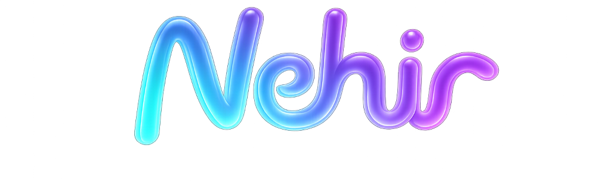
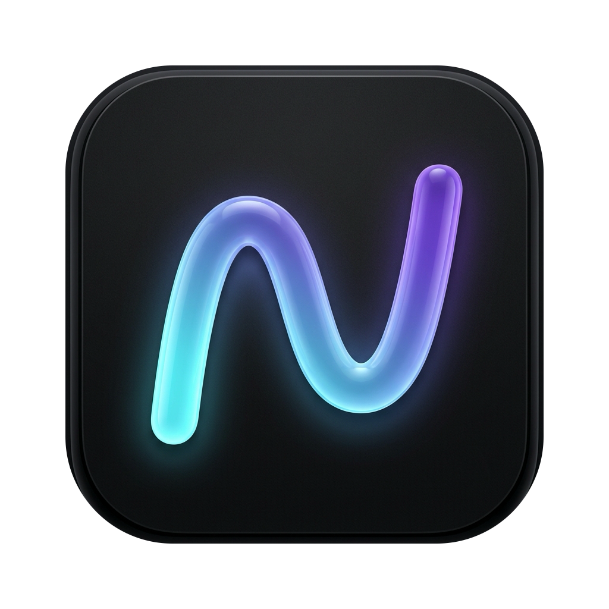

<h1 align="center">
  
</h1>



A scrolling tiling window manager for macOS, built on the Niri column layout paradigm.

> **Nehir** (Turkish for "river") — windows flow in columns, scrolling horizontally across your screen.

## Features

- **Niri scrolling column layout** — windows arranged in columns that scroll horizontally, with automatic overflow tabbing when stacked windows cannot fit at their minimum heights
- **Workspace management** — multiple workspaces with hotkey switching
- **Window borders** — configurable colored borders on the focused window
- **Workspace bar** — per-monitor status bar showing workspace names and app icons
- **Focus follows mouse** — optional hover focus
- **Multi-monitor support** — seamless window management across displays. For the best Niri scrolling experience, use an auto-hide Dock and arrange displays vertically in macOS System Settings to avoid parked offscreen windows bleeding onto neighboring monitors.
- **Overview mode** — bird's-eye view of all windows
- **Command palette** — fuzzy search for commands
- **App rules** — per-application layout overrides
- **IPC** — Unix socket for external control via `nehirctl`
- **TOML configuration** — split config under `~/.config/nehir/`

## Install

### Homebrew

After the first release is published, Nehir can be distributed from the `guria/tap` Homebrew tap:

```bash
brew tap guria/tap
brew install --cask nehir
```

Nehir requires Accessibility permissions after installation:

```text
System Settings > Privacy & Security > Accessibility
```

### From source

```bash
# Package the app bundle
mise run package:release

# User-local install (no sudo)
mkdir -p "$HOME/Applications" "$HOME/.local/bin"
rm -rf "$HOME/Applications/Nehir.app"
cp -R dist/Nehir.app "$HOME/Applications/Nehir.app"
install -m 755 .build/apple/Products/Release/nehirctl "$HOME/.local/bin/nehirctl"
```

Or use mise:

```bash
# User-local install
mise run install

# System-wide install
mise run install:system
```

## Usage

```bash
# Run
Nehir

# CLI control (requires IPC enabled)
nehirctl command focus left
nehirctl command switch-workspace 2
nehirctl --help
```

## Debugging & Tracing

Nehir includes runtime debugging and trace-capture commands. They are exposed consistently through IPC/CLI, the command palette, and hotkey handling, and appear in the **Debugging & Tracing** category:

- **Debug: Dump Runtime State** — copies the current runtime debug dump to the clipboard and writes it to the unified log
- **Debug: Reset Runtime State** — clears runtime debugging state and reboots tracking from a startup-style rescan
- **Debug: Restart Clearing Runtime State** — clears runtime debugging state and relaunches the app
- **Debug: Toggle Trace Capture** — default hotkey: `Ctrl+Option+Cmd+T`
  - IPC/CLI accepts an optional `desiredState` argument (`active` or `inactive`) for idempotent scripting: `nehirctl command debug trace toggle active`

Stopping a trace capture writes a log bundle to:

```text
${XDG_STATE_HOME:-$HOME/.local/state}/nehir/traces/
```

and copies the dumped file path to the clipboard.

For feedback/debug reports: toggle tracing on, reproduce the issue, toggle tracing off, then share the copied trace-bundle path or file. An optional **Show Trace Capture Button** workspace-bar setting provides the same toggle in the bar for advanced users and developers.

For IPC/CLI usage, see [docs/IPC-CLI.md](docs/IPC-CLI.md).

## Configuration

Nehir uses a split-file config layout under `~/.config/nehir/`:

```
~/.config/nehir/
├── settings.toml      # core app behavior
├── hotkeys.toml       # physical keybindings
├── workspaces.toml    # workspace definitions
├── apprules.d/        # one file per app rule
│   ├── com-google-chrome.toml
│   └── pip-floating.toml.sample   # inactive sample
└── monitors.d/        # per-monitor overrides
    └── studio-display.toml
```

All files are watched for changes — edits are applied live without restarting.

See [Configuration Principles](docs/CONFIGURATION.md) for the design rationale.

### Mouse focus behavior

Two settings interact here:

- `moveMouseToFocusedWindow` moves the pointer after focus changes, but Nehir treats it primarily as a keyboard/command-navigation affordance. Pointer-originated focus changes do not warp the cursor: mouse hover/click, workspace bar clicks, tab overlay clicks, trackpad gestures, scroll animations, and floating-window clicks/drags all preserve pointer position.
- Empty workspace command switching is the main intentional exception: when there is no focused window target, Nehir warps to the target monitor center so the pointer lands on the display you navigated to.
- `focusFollowsMouse` is debounced and refreshes after scroll/swipe animations settle and after owned Nehir UI windows (Settings, App Rules, Command Palette) close, because those interactions may not generate a fresh mouse-move event.
- With `focusFollowsMouse` enabled, swipe gesture end updates the viewport selection but does not commit focus to the snapped column; final focus follows the pointer after the gesture/animation settles.
- Tiled hover focus is disabled while a floating window is the active surface above the Niri layout, so moving toward that floating window does not accidentally focus and raise a tiled column behind it.
- A floating window that is merely visible but behind the active tiled window does not disable tiled hover focus.
- Hover focus is also blocked over visible unmanaged WindowServer windows and briefly suppressed after floating/unmanaged pointer interaction so clicking or dragging those windows does not immediately activate a tiled column behind them.

### Default Shortcut Model

Nehir defaults are stored and shown as physical key chords.

- **Option+Command** — navigate, focus, and open UI
- **Option+Shift+Command** — move the focused window
- **Control+Option+Command** — larger-scope navigation such as workspace history and column indexes
- **Hyper** — physical Control+Option+Shift+Command, reserved for structural moves

For a lighter way to enter the base layer, see the [Karabiner double-Command recipe](docs/recipes/karabiner-double-command-sticky-command-option.json).

The goal is a small set of predictable modifier patterns:

```text
without Shift = go there
with Shift    = move current window there
Hyper         = reshape or move structure
```

## Development

```bash
# Build (debug)
mise run build

# Build and run
mise run dev

# Release build
mise run build:release

# Run tests (requires Xcode)
mise run test

# Clean
mise run clean
```

## Lineage

Nehir is the macOS embodiment of an idea with a clear family tree.

### Paradigm — Niri

Nehir's interaction model — windows in horizontally scrolling columns — is a direct port of [Niri]'s design language. Niri is a scrollable tiling Wayland compositor; Nehir brings that workflow to macOS.

### Code — OmniWM

Nehir is an opinionated fork of [OmniWM], a general-purpose macOS tiling window manager by BarutSRB. We borrowed its macOS window-management engine and narrowed it to a single layout engine, dropping backward-compatibility baggage to do one thing well. Deeply grateful to the original author for the foundation — see [NOTICE.md](NOTICE.md) for full attribution.

> The upstream repo has been renamed to [Hiro](https://github.com/BarutSRB/Hiro), with a rewrite under that name announced for a future release. The code Nehir forks from is OmniWM.

<details>
<summary><strong>Notable changes from OmniWM</strong></summary>

- **Single layout model.** Nehir is rebuilt around Niri-style scrolling columns instead of keeping multiple layout/control models.
- **No legacy compatibility layer.** Configuration, defaults, hotkeys, and behavior are allowed to change to fit Nehir's narrower workflow.
- **Required motion stays enabled.** Unlike OmniWM's user-toggleable animation preference, Nehir treats layout motion as part of the interaction model: disabling it makes Niri-style scrolling, resizing, and transition state hard to follow, so there is no `animationsEnabled` setting.
- **Split TOML configuration.** Runtime config is organized under `~/.config/nehir/` with separate files for settings, hotkeys, workspaces, app rules, and monitor overrides.
- **Close/collapse focus stays local.** When macOS reports another same-app window as focused after closing or collapsing the current one, Nehir treats that as native fallback focus rather than user navigation. Same-app fallback to inactive workspaces is ignored, and unmanaged quick-terminal fallback is also ignored on the current workspace so the viewport does not scroll to that app's managed column. Explicit Nehir focus commands still take precedence.
- **Configurable gesture scroll snap.** Trackpad swipe gestures can snap to column boundaries or stop freely mid-scroll. Controlled by `gestures.scrollSnap` in `settings.toml` (default `true`).
- **Smarter mouse focus and cursor warp.** Pointer-initiated focus no longer makes `moveMouseToFocusedWindow` jump the cursor, and hover focus is constrained around floating/unmanaged windows to fit the Niri layout model.
- **Built-in runtime debugging tools.** Nehir now ships command-palette and IPC/CLI actions to dump runtime state, reset/rebootstrap runtime state, restart while clearing runtime state, and capture runtime trace bundles under `${XDG_STATE_HOME:-$HOME/.local/state}/nehir/traces/`.

</details>

### Peers — scrollable tiling elsewhere

Nehir is one of several projects exploring this workflow:

- [PaperWM] — GNOME Shell.
- [Paneru] — macOS (another Niri-inspired strip manager).
- [karousel] — KDE.
- [papersway] — sway/i3.
- [hyprscroller] and [hyprslidr] — Hyprland.
- [PaperWM.spoon] — macOS (Hammerspoon).

[Niri]: https://github.com/niri-wm/niri
[OmniWM]: https://github.com/BarutSRB/OmniWM
[PaperWM]: https://github.com/paperwm/PaperWM
[Paneru]: https://github.com/karinushka/paneru
[karousel]: https://github.com/peterfajdiga/karousel
[papersway]: https://spwhitton.name/tech/code/papersway/
[hyprscroller]: https://github.com/dawsers/hyprscroller
[hyprslidr]: https://gitlab.com/magus/hyprslidr
[PaperWM.spoon]: https://github.com/mogenson/PaperWM.spoon

## License

GPL-2.0-only
